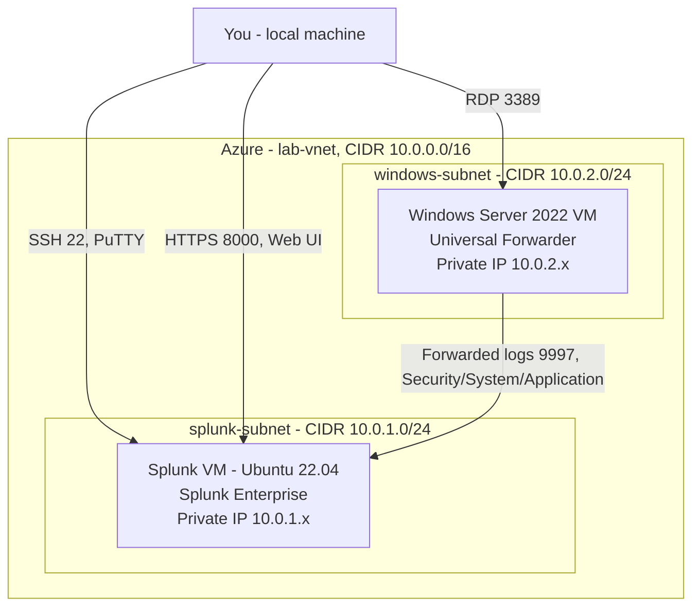

# Splunk SIEM Lab — Windows Security Monitoring on Azure


A self-hosted Splunk SIEM deployment on Azure, ingesting Windows Security, System, and Application event logs from a domain-joined server via the Splunk Universal Forwarder, with a detection dashboard and a scheduled alert built on top. This project replicates the core workflow of a Tier 1–2 SOC analyst: get log data flowing into a SIEM, build visibility into it, and automate detection so nobody has to watch a dashboard around the clock.

## Overview

Organizations generate log data across dozens of disconnected systems — endpoints, domain controllers, firewalls, applications. Without a SIEM, that data is unsearchable and uncorrelated; an analyst investigating an incident has to log into each system individually. This lab stands up Splunk Enterprise as the central log repository, wires up a Windows Server as a log source, and builds the detection layer (dashboard + alert) on top — the same pattern used in production security operations centers, just at home-lab scale.

## Architecture



Both VMs sit in a single VNet, each in its own subnet — a deliberate design choice to keep forwarder traffic internal to the network without introducing VNet Peering. The only paths open to the public internet are the three management paths (SSH, the Splunk web UI, RDP), each restricted by NSG rule to a single source IP.

| Component | Detail |
|---|---|
| Splunk VM | Ubuntu 22.04 LTS, Standard_B2s, Splunk Enterprise (free license, 500MB/day) |
| Log source | Windows Server 2022, Splunk Universal Forwarder |
| Transport | TCP/9997, internal to `lab-vnet` only |
| Data collected | Windows Security, System, and Application event logs |
| Index | `windows_logs` |

## What This Demonstrates

- Deploying and licensing Splunk Enterprise on a Linux host
- Configuring the Universal Forwarder and `inputs.conf` to collect specific Windows Event Log channels
- Designing Azure network segmentation (VNet/subnet layout, NSG rules scoped by source) for a multi-tier lab environment
- Writing SPL to identify authentication activity, after-hours access, and privileged logon abuse
- Building a Classic Dashboard for at-a-glance security posture
- Configuring a scheduled, threshold-based alert — the same detection pattern used in production SOC tooling

## Detections Implemented

| Detection | Event Code | Purpose |
|---|---|---|
| Successful logins by account | 4624 | Baseline authentication activity, grouped by account |
| After-hours logins | 4624 | Flags human logins outside a 7am–7pm window — a common indicator worth reviewing |
| High privileged logon count | 4672 | Scheduled alert; fires when an account exceeds 50 privileged logons, a signal of possible admin-rights abuse |

SPL for each is in [`lab-guide.md`](./lab-guide.md), Steps 12–14.

## Dashboard

**Windows Security Overview** — four panels: account activity (bar chart), top processes by execution count (table), login activity over time (line chart), and after-hours logins (table).

``

## Automated Alert

**High Privileged Logon Count** — runs every 15 minutes via cron schedule (`*/15 * * * *`), triggers when any account/host pair exceeds 50 EventCode 4672 events, and logs to Splunk's built-in Triggered Alerts history. The threshold is a starting point, not a fixed rule — in a production environment it would be tuned against observed false-positive rate.

``

## Repository Contents

```
├── README.md           — this file
├── lab-guide.md         — full step-by-step build guide, PuTTY/Azure walkthrough
└── screenshots/
    ├── dashboard.png
    └── alert-config.png
```

## Reproducing This Lab

Full build instructions, including exact Azure portal clicks, NSG rule configuration, and every PowerShell command used, are in [`lab-guide.md`](./lab-guide.md). Estimated time: 4–6 hours across multiple sessions. Cost: $0 — Splunk's free license and Azure free-tier-eligible VM sizes cover the entire build.

**Prerequisites:** an Azure subscription, a free Splunk account, and (on Windows) PuTTY for SSH access to the Linux VM.

## Challenges & Troubleshooting

Documented here deliberately — working through these was as much a part of the exercise as the SPL itself.

- **VNet address space conflicts.** An early iteration placed each VM in its own VNet with identical default address spaces (`172.16.0.0/16`), which Azure correctly refused to peer. Resolved by consolidating both VMs into a single VNet with two subnets from the start, removing the need for peering entirely.
- **Universal Forwarder installer failing silently.** The Windows installer wizard, run through a browser blocked by Windows Server's default IE Enhanced Security Configuration, did not complete — leaving no `SplunkForwarder` service and no error visible until the data pipeline was debugged from the Splunk side. Resolved by installing via a single `msiexec` command from an elevated PowerShell session, with an immediate `Get-Service` check to confirm success before proceeding.
- **`inputs.conf` not saving as expected.** Editing the file through a GUI editor without elevated permissions led to inconsistent save behavior. Resolved by writing the file directly through PowerShell (`Set-Content`) running as Administrator, with a `Get-Content` read-back as a verification step.

## Certification Alignment

CompTIA Security+ · CompTIA CySA+ · Splunk Core Certified User

## Author

[Your Name] — [LinkedIn] · [Portfolio]
